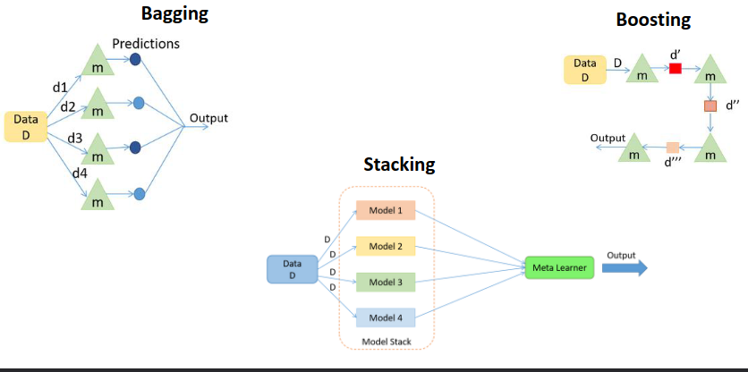

# *Ensemble Learning*

## Principais Classes de *Ensemble Learning*

## *Max Voting* (Classificação)

- Cada modelo de ML faz um voto e a opção mais votada é selecionada. Simples, mas efetivo;
- Há dois tipos de *max voting*:
  - *Hard Voting*:
    - $C_1$ prevê A;
    - $C_2$ prevê B;
    - $C_3$ prevê B;
    - Como $\frac{2}{3}$ dos modelos previram a classe B, a classe B é a *ensemble decision*.
  - *Soft Voting*:
    - $C_1$ prevê A com probabilidade de 99\%;
    - $C_2$ prevê A com probabilidade de 49\%;
    - $C_3$ prevê A com probabilidade de 49\%;
    - A probabilidade média de pertencer a A é de 65.67\%, no entanto, a classe A é a *ensemble decision*.

## Peso médio e pesado (Regressão)

- A previsão final que devemos considerar é a média dos modelos de previsão;
- Um modelo de *ensemble* de peso pesado permite que múltiplos modelos contribuam para a previsão baseada acerca do quão bom o modelo é. Se o modelo for melhor que o *dataset* em geral, dar-lhe-emos mais peso. Esta generalização ajudará a reduzir a tendência e a melhor o desempenho geral.

## *Bagging (Bootstrap Aggregation)*

- Tem dois passos principais:
  - Utiliza dados de treino existentes e faz instâncias múltiplas de dados (*bootstrapping*), podendo, para isso, utilizar conjuntos de treino múltiplas vezes;
  - Faz múltiplos modelos com base nos dados obtidos pelo *bootstrap* e múltiplos modelos de *output*. Agrega os resultados do modelo e obtém o resultado final.

## *Random Forest*

1. Cria um *bootstrapped dataset*;
2. Constrói uma árvore de decisão;
   1. Utilizando *bootstrapped data* e
   2. Considerando um conjunto aleatório de subconjuntos de atributos (o número de atributos, geralmente, é a raíz quadrada de $n$);
3. Repetir os passos 1 e 2 pelo número de árvores pretendidas;
4. Estimar a assertividade da *Random Forest*.
   1. Utilizando amostras *Out-Of-Bag* e agregação, calculando o erro *Out-Of-Bag*;
   2. Iterar pelos passos 2 e 3, alterando o número de atributos utilizados, minimizando o erro.

## *Boosting*

Inicialmente, um modelo é corrido e os resultados são obtidos, onde pontos específicos são classificados de forma correta e os restantes de forma incorreta. Damos mais peso a pontos que são incorretamente classificados e voltamos a correr o modelo. Visto que existem pontos específicos com maior peso, é muito provável que o modelo os vá incluir.

Continuamos a repetir este processo e múltiplos modelos são criados, onde cada um irá corrigir os erros do modelo anterior.

## *AdaBoost vs XGBoost*

***AdaBoost*** (*adaptive boosting*):
- Combina árvores de decisão (aprendizes fracos);
- Dá peso aos valores incorretos;
- Crescimento sequencial da árvore considerando os erros do passado;
- Robusto perante o *overfitting*;
- Tem poucos híperparâmetros.

***XgBoost*** (*gradient boosting*):
- A ideia é usar o *gradient descent* para otimizar os parâmetros dos novos estimadores como estimadores adicionados no *boosting*;
- Ao tirar as melhores partes do *AdaBoost* e *Random Forests*, adicionando alguns atributos:
  - Crescimento sequencial da árvore;
  - Minimiza a função de perda utilizando o *gradient descent*;
  - Processamento paralelo;
  - Regularização dos parâmetros.

## *Stacking*

A ideia de fazer *stacking* é fazer muitas previsões nos *datasets* de treino e teste com poucos modelos. Isto é feito tanto no *dataset* de treino, como no *dataset* de teste.

Assim, não consideramos os dados originais e de teste, mas sim os novos modelos de *output* nos dados de treino como o modelo de treino base. Os novos dados de treino são os modelos de *output* dos dados de teste.

## *Blending*

Podemos pensar em *blending* como um tipo de *stacking*, onde o meta-modelo é treinado nas previsões feitas pelo modelo no conjunto de validação *hold-out*.

## *Ensemble Learning*

Os modelos trabalham combinando múltiplos *learners* de base num único líder forte, ajudando a diminuir a tendência, a variância e melhorando as previsões.

Existem dois grupos de modelos de *ensemble*:

- **Modelos de *ensemble* paralelo**: tem como lógica aumentar a independência entre os *learners* de base. Apesar dos erros das previsões feitas pelos modelos serem diferentes, isto permite que o *ensemble model* possa fazer uma média dos erros;
  - Exemplos: *Random Forest* com árvores de decisão independentes.
- **Modelos de *ensemble* sequencial**: tem como lógica aumentar a dependência entre os *learners* de base. Apesar dos erros feitos pelo modelo 1 estarem sequencialmente corretos, pelo modelo 2 também e por aí adiante, isto ajuda a obter o *ensemble* mais preciso possível.
  - Exemplos: *AdaBoost ensemble model*.