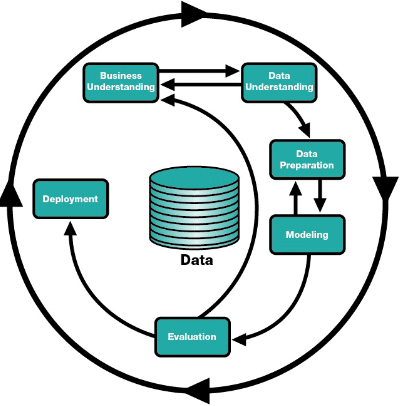

# Teórica 02

## Aprendizagem Automática (*Machine Learning*) *vs* Ciência de Dados (*Data Science*)

### *Machine Learning*

- Utiliza dados;
- Tem como produto final um artefacto de *software*;
- Quem trabalha em ML são *Data Engineer*.

### *Data Science*

- Analisa conjuntos de dados;
- Tem como produto final apresentações e relatórios;
- Quem trabalha em DS são *Data Scientists*.

## Aprendizagem

- Ganhar capacidades e conhecimentos;
- Criar uma linha de raciocínio para resolver problemas;
- Memorizar;
- Reconhecer erros;
- Corrigir erros;
- Imitar comportamentos.

## Aprendizagem Automática

Capacidade de aprender de modo autónomo e independente.

Os algoritmos de *machine learning* são algoritmos orientados aos dados.

## Aprendizagem Simbólica *vs* Aprendizagem Não Simbólica

### Aprendizagem Simbólica

- É capaz de explicar as suas decisões;
- Não é capaz de dar resposta a alguns problemas, pois as regras e o conhecimento têm de ser codificados à mão;
- Está muito presa ao mundo académico e aos laboratórios universitários.
- **Exemplos**: Baseado em Casos, Árvores de Decisão, etc...

### Aprendizagem Não Simbólica

- Não é capaz de explicar as suas decisões;
- Apresenta melhores resultados que a AS;
- É, em geral, menos aceitável em decisões de alto risco.
- **Exemplos**: Redes Neuronais Artificiais, Algoritmos Genéticos e Evolucionários, etc...

## Aprendizagem Supervisionada

- Aprende com dados para os quais já sabe a resposta correta;
- A grande maioria dos algoritmos de ML utiliza este tipo de aprendizagem;
- Normalmente, são divididos em 2 categorias:
  - **Classificação**: Apresenta os resultados em classes;
  - **Regressão**: Apresenta resultados em forma contínua.

## Aprendizagem Não Supervisionada

- Aprende com dados para os quais não se sabe a resposta certa;
- Tem como objetivo modelar a estrutura ou a distribuição dos dados do problema.
- Divide-se em 3 categorias:
  - **Segmentação (*clustering*)**: Organização dos dados em grupos coerentes;
  - **Redução (*reduction*)**: Reduzir o número de características ou decompor o conjunto de dados em múltiplos componentes;
  - **Associação**: Procura regras que associem o comportamento demonstrado pelos dados.

## Aprendizagem por Reforço

- Utilizam técnicas de auto-alimentação de sinais com a noção de recompensa/penalização;
- Tem capacidade crítica sobre os próprios resultados produzidos pelo algoritmo;
- 2 categorias:
  - ***Q-Learning***: Assume que se está a seguir uma política ótima e utiliza-a para atualização dos valores das ações;
  - ***SARSA***: Considera a política de controlo que está a ser seguida e atualiza o valor das ações.

## Metodologias

Existem duas grandes metodologias:

1. **CRISP-DM**;
2. **SEMMA**.

### Motivos para utilizar

- Permite que os projetos sejam replicados;
- Apoia no planeamento e gestão do projeto;
- Incentiva as melhores práticas e ajuda a obter os melhores resultados.

### *SEMMA*

Dividido em diversas etapas que funcionam de forma circular:

1. ***S****ample*: Recolhe uma parte representativa dos dados;
2. ***E****xplore*: Exploração e análise de dados;
3. ***M****odify*: Engenharia e transformação de *features*;
4. ***M****odel*: Conceção do modelo;
5. ***A****ssess*: Avaliação do modelo.

### *CRISP-DM*

