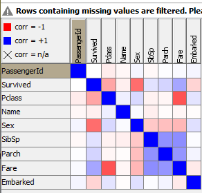
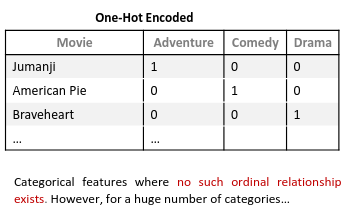
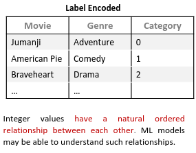

# Teórica 03

## Exploração e Preparação de Dados

**Problemas**:
- Valores em falta;
  - Informação em falta porque não foi coletada ou é informação sensível;
  - Atributos que não são aplicáveis para todos os elementos.
- Registos Duplicados;
  - Os mesmos dados (ou dados semelhantes) colecionados em fontes diferentes
- Ruído;
  - Modificação dos registos originais (dados corrompidos ou distorcidos) devido a limitações técnicas, erros de sensores ou erro humano.
- *Outliers*.
  - A ponto nos dados que difere de forma significativa das outras observações.

## Porquê Preparar os Dados?

- Compreender os dados e as suas características;
- Avaliar a qualidade dos dados;
- Encontrar padrões e informações relevantes.

## Como Preparar os Dados?

- **Tendência Central**: média, moda, mediana...
- **Dispersão Estatística**: variância, desvio padrão, distância interquartil...
- **Distribuição Probabilística**: gaussiana, uniforme, exponencial...
- **Correlação/Dependência**: entre pares de características, com dependência de características...
- **Visualização de Dados**: tabelas, gráficos, *boxplots*, *scatter plots*, histogramas...

## Matrizes de Correlação

- Se a correlação entre atributos for alta $\rightarrow$ não temos de ter ambos os atributos no modelo;
- Se a correlação com a variável que pretendemos estudar for alta $\rightarrow$ devemos colocar a variável com alta correlação no modelo.

## Preparação de Dados

### Prearação Básica

- O *join* é uma operação que nos permite combinar dados de diferentes tabelas de forma diferente:

- As seguintes técnicas podem ser utilizados:
  - Reunião/Interseção de colunas;
  - Concatenação;
  - *Sorters*;
  - Filtros (de coluna, de linha, nominais e baseados em regras, etc...);
  - Agregações básicas (contagens, únicas, média/soma, etc...)

### Preparação Avançada

**Como?**

- *Feature Scaling*;
- Deteção de *Outliers*;
- *Feature Selection*;
- Tratamento de *Missing Values*;
- Discretização de Valores Nominais;
- *Binning*;
- *Feature Engineering*.

#### *Feature Scaling*

- Útil para casos e que a escala entre *features* é muito diferente;
- Normaliza os atributos de forma a reduzir a diferença entre atributos;
- **Técnicas**:
  - Standardização: média de 0 e desvio padrão de 1;
    - deve utilizar-se quando a distribuição segue uma curva normal (em forma de sino).
  - Normalização: mete todos os valores entre 0 e 1 ou -1 e 1.
    - nos outros casos.

**NOTAS**
- Em geral, a standardização produz um melhor resultado;
- Não faz sentido normalizar ou standardizar a variável resultado (também chamada variável dependente ou *label*).

#### Deteção de *Outliers*

**Métodos**:
- Estratégia Baseada em Estatísticas: *Z-Score*, *Box Plots*, ...
- Estratégia Baseada em Conhecimento: Baseada no conhecimento
- Estratégia Baseada em Modelos: Utiliza modelos como *one-class SVMs*, *isolation forests*, *clustering*, ...

**Dilema**: *Drop* ou *Cap*?

- Geralmente, depende do tamanho do *dataset*:
  - Se for muito grande: *Drop*;
  - Caso contrário: *Cap*.

#### *Feature Selection*

- Reduz o número de atributos que o modelo terá de estudar;
- Geralmente, melhora o desempenho e diminui a complexidade;
- O que remover?
  - Atributos com elevada % de *missing values*;
  - Teste do *chi-square* para ver dependências;
  - Atributos com baixa variância;
  - Atributos muito distorcidos;
  - Atributos com grande correlação entre eles.
- **Técnicas**:
  - PCA (*Principal Component Analysis*);
    - Técnica para reduzir a dimensão do espaço de atributos. O objetivo é reduzir o número de atributos sem perder muita informação. Uma utilização popular é a visualização de dados de grandes dimensões;
  - *Wrapper Methods*:
    - Utiliza um algoritmo de ML para selecionar os atributos mais importantes. Seleciona um conjunto de atributos como um problema de pesquisa, prepara diferentes combinações, avalia-as e compara-as. Mede a "utilidade" dos atributos baseando no classificador de *performance*.
  - *Embedded Methods*: Algoritmos que já têm métodos de seleção *built-in*. 

#### *Missing Values*

Inicialmente, analisa cada atributo quanto ao número e percentagem de *missing values* e com base nisso decide o que fazer:

- Remover;
- Substituir pela média;
- Interpolar o valor;
- Mascarar o valor;
- ...

#### Discretizção de Valores Nominais

Dados categóricos, muitas vezes denominados dados nominais, são variáveis que contêm uma etiqueta associada ao invés de um valor numérico. Isto pode não ser desejável, então existem diverso métodos para passar as etiquetas para valores numéricos:

- *One-Hot Encoding*:

- *Label Encoding*:

- *Binary Encoding*:
  - Semelhante ao *Label Encoding*, mas com binário.
    - Permite uma noção mais fácil de ordem.

#### *Binning* (Discretização)

- Grupos numéricos de dados divididos em intervalos.
  - Isto torna o modelo mais robusto e evita o *overfitting*;
  - Penaliza a *performance* do modelo, visto que, sempre que se cria um intervalo sacrifica-se informação.

#### *Feature Engineering*

- Cria atributos a partir de outros atributos existentes;
- Tem por objetivo a melhoria da *performance* dos modelos de ML.