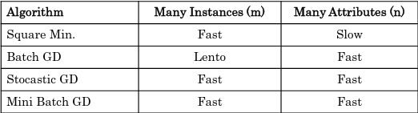

# Teórica 04

## Aprendizagem Supervisionada - Regressão Linear e Logística

### Modelos Lineares

- Caracterizadas pela simplicidade de cálculos e análises;
- Linearidade é definida nos termos de funções com as seguintes propriedades:
  - $f(x+y)=f(x)+f(y)$;
  - $f(ax)=af(x)$.
- Usada para classificação (seperação entre classes) e regressão;
- Não resolve problemas não-lineares.

### Regressão Linear

Tenciona prever o valor de saída $Y$ baseado na variável de entrada $X$.

- Enquandra uma linha reta num conjunto de dados de observações;
- Utiliza esta linha para prever valores não observados.

#### Modelos de Regressão Linear

Representa a relação entre variáveis de entrada $x_1,..., x_n$ e uma variável de saída $y$.

Previsão do modelo (para o i-ésimo modelo):
 - $n \rightarrow$ número de atributos;
 - $\Theta \rightarrow$ parâmetros do modelo.  
$$ŷ_{(i)} = h_{\Theta}(x_{1}^{(i)},...,x_{n}^{(i)})$$

- **Como funciona?**
  - Geralmente, utiliza uma função de "Custo por Erro/Perda" e minimizar o seu valor (minimizar o erro quadrado entre cada ponto da linha).
- **Função do custo por erro/perda**: MSE (*means square error*)
- **Objetivo**: identificar os parâmetros do modelo de forma a minimizar o valor de J.

#### Múltipla Regressão Linear

- Utilizada para determinar o efeito do número de variáveis independentes ($x_1, x_2, ..., x_n$) numa única variável dependente ($y$).
  
### Regressão Logística

- Variável dependente discreta: problema de classificação;
- Utiliza modelos de regressão para classificação binária através da interpretação de modelos de *output* de forma a extraír a classe.
- O modelo é dado pela aplicação da *sigmoid* à função de regressão linear.

#### Função *Sigmoid*

- Recebe qualquer valor e coloca o seu *output* entre 0 e 1;
- Isto provoca uma probabilidade entre 0 e 1 de permanecer a uma classe;
- Podemos definir um ponto de *threshold* em 0.5, definindo:
  - Baseado na probabilidade, é *assigned* a classe;
  - Resultados previstos abaixo do *threshold* vão para a classe 0;
  - Resultados previstos acima do *threshold* vão para a classe 1.

#### Múltiplas Classes

- Pode ser aplicada para mais do que 2 classes;
- Neste caso, a estratégia é treinar o modelo "binário" para classe de forma separada;
- Cada modelo estima a probabilidade do exemplo pertencer à dada classe;
- Na altura de prever novos exemplos, cada modelo é aplicado escolhendo a classe da qual o valor previsto do modelo é maior.

#### Função de erro:

Para cada exemplo $x$:

- Se y = 1: $-log(h_{\Theta}(x))$;
  - Se a previsão for correta, **o erro é zero**;
  - Caso contrário, quando se aproxima de 0, o erro tende para infinito.
- Se y = 0 $-log(1-h_{\Theta}(x))$.
  - Se a previsão for correta, **o erro é zero**;
  - Caso contrário, quando se aproxima de 1, o erro tende para infinita.

## Estimativa de Parâmetros

### Otimização

Conhecendo a estrutura do modelo: a estimativa de parâmetros é o problema de otimização numérica - minimização da função de erro.

No caso de modelos lineares, o método dos mínimos quadrados podem ser utilizados, o que minimiza a função de erro (quadrado dos erros) ou o método iterativo.

### Método dos Mínimos Quadrados

Método analítico para determinar os valores ótimos que minimizam J.

A complexidade computacional ao treinar um modelo utilizando este método é linear ao número de instâncias e atributos.

### Gradiente Descendente para Regressão Linear

Método que depende da função de erro ser diferenciável. Método iterativo em que cada iteração altera os valores de cada um dos parâmetros $\Theta_{j}$

O parâmetro $\alpha$ é a taxa de aprendizagem e controla a velocidade de atualização dos parâmetros.

- Baixos valores de $\alpha$ garantem convergência mas podem ser mais lentos;
- Altos valores de $\alpha$ podem trazer uma convergência rápida, mas tem o risco de divergência.

### Gradiente Descendente *vs* Método Analítico

- MA garante a solução ótima, GD pode não convergir;
- No MA não existem parâmetros, GD pode demorar a convergir;
- MA pode tornar-se muito lento quando $N$ for muito grande;
- Modelos genéricos de GD são aplicáveis para outros tipos de modelo.

### Métodos Avançados

## Soluções Para *Overfitting*: Modelos Funcionais

- Reduzir o número de atributos (coeficientes) utilizados;
- Selecionar atributos "manualmente" tendo por base o conhecimento do programa;
- Utilizar algoritmos de seleções de atributos;
- Regularização.
  - Manter todos os atributos mas tentar reduzir a magnitude dos valores dos parâmetros.

## Standardização e Normalização

- Tranformações nos dados são, por vezes, necessárias para os algoritmos de aprendizagem funcionarem melhor;
- Algoritmos de GD podem não ter um funcionamento correta com variáveis de escalas muito diferentes;
- Vários métodos possíveis:
  - Converter a média para 0 e o desvio padrão para 1;
  - Converter os valores para um intervalo de 0 a 1 ou de -1 a 1, definindo os valores mínimos e máximos.

