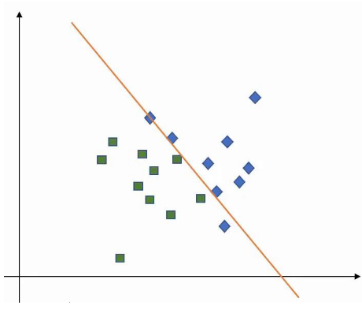
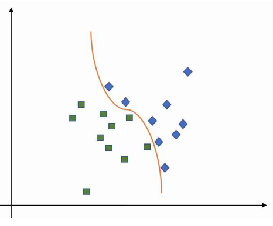
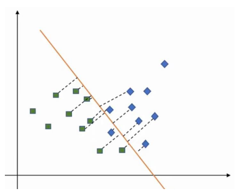
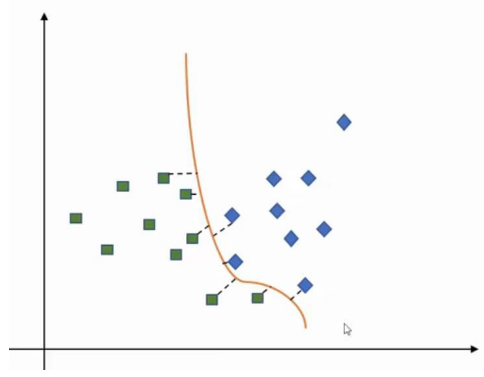

# Máquinas de Vetores de Suporte

- Algoritmo de *Machine Learning* supervisionado que pode ser utilizado para problemas de classificação (quase) e problemas de regressão;
- Geralmente, um algoritmode aprendizagem tenta aprender o máximo sobre as características comuns (o que diferencia uma classe de outra) de uma classe e a classificação será feita baseando-se nessas características representativas sobre as quais aprendeu (a classificação é baseada na diferença entre as classes). No entanto, as SVM trabalham de forma oposta, ou seja, procuram a similaridade entre classes e utiliza-as como "vetores de suporte";
- A ideia principal é dar *plot* a cada item daos dados como um ponto num espaço $n$-dimensional (em que $n$ é o número de atributos), fazendo a classificação a partir da descoberta de um híper-plano que diferencie as classes;
- Funciona bem para classifcar *datasets* com muitos atributos;
- Encontra vetores de suporte que dividem os dados;
- Aplica *kernels* de forma a representar os dados em espaços de vários dimensões para encontrar os híper-planos que podem não surgir em dimensões pequenas;
- Os híperlanos são barreiras de decisão que ajudam a classificar os pontos dos dados;
- Pontos que se encontrem em ambos os lados de um plano podem ser atribuídos a diferentes classes;
- A dimensão do híper-plano dependerá do número de atributos, ou seja, no caso de só termos 2 atributos, o híper-plano será uma linha, já no caso de termos 3 atributos, o híper-plano será um plano 2D.

## Como funciona?

1. Tem-se um conjunto de dados de treino etiquetado;
2. Desenha-se um híper-plano que separe as classes;
   1. Podendo desenhar vários, deve escolher-se aquele que maximize a margem entre classes;
   2. Os pontos presentes nas linhas de margem de cada classe são denominados de vetores de suporte.

## *Hinge Loss*

- Pretendemos maximizar as margens entre os pontos dos dados e o híper-plano definido. Para isso, as SVMs utilizam a *hinge loss*:

$$l(y) = max(0, 1 - t \dot y)$$

- Isto irá:
  - Retornar 0 no caso do valor previsto e o valor real serem ambos positiovs, negativos ou nulos;
  - Senão, irá calcular a perda.

## *Kernels*

- Diferentes *Kernels* providenciam diferentes resultados para um dado *dataset*:
  - **Linear**;
  - ***Gaussian Radial Basis Function*** (RBF);
  - **Polinomial**;
  - **Sigmoidal**.

## Regularização

### Baixa Regularização

O otimizador irá procurar por um híper-plano que tenha uma **grande margem**, mesmo que isso implique classificar mais pontos de forma errada.

### Alta Regularização

O otimizador irá escolher um híper-plano com uma menor margem, caso isso implque uma melhor classificação dos pontos.

## *Gamma*

### *Gamma* Baixo

Pontos longe do possível plano são considerados no cálculo do plano.

### *Gamma* Alto

Apenas os pontos perto do possível plano são considerados.

## Margem

### Má Margem

Está demasiado perto de uma classe e distante da outra.

### Boa Margem

Está equidistante de ambas as classes.

## Pontos

### Fortes

- Muito efetivo em *datasets* com um grande conjunto de atributos (p.e. financeiros ou médicos);
- Efetivo nos casos em que o número de atributos é superior ao número de pontos de dados;
- Utiliza um subconjunto de pontos de treino na função de decisão dos vetores de suiporte que tem um consumo eficiente de memória;
- Funções de *kernel* diferentes podem ser especificadas para uma função de decisão (é possível utilizar *kernels* comuns, mas também se pode criar o próprio *kernel*).

### Fracos

- Se o número de atributos for muito maior que o número de pontos, é crucial evitar o *overfitting* aquando da escolha da função de *kernel* e do termo de regularização;
- Não providenciam estimativas de probabilidades de forma direta. São calculadas utilizando um método caro de *n-fold cross-validation*;
- Trabalham melhor em conjuntos de amostras pequenos, devido ao elevado tempo de aprendizagem que requerem.

## Regressão de Vetores de Suporte

- Algoritmo supervisionado para prever valores discretos;
- Usa os mesmos princípios que as SVMs;
- A ideia principal é encontrar a melhor linha de enquadramento, sendo que será aquela que tiver o número máximo de pontos nela;
- Basicamente, o objetivo passa por considerar os pontos que estão na linha fronteira de decisão.

### Pontos

#### Fortes

- Robusto no tratamento de *outliers*;
- O modelo de decisão pode ser facilmente atualizado;
- Tem uma grande capacidade de generalização, com uma grande taxa de acerto;
- A sua implementação é fácil.

#### Fracos

- Não é aplicável em *datasets* grandes;
- Nos casos em que o número de atributos for maior para cada ponto de dados que o número de amostras de treino, o algoritmo terá um desempenho abaixo do esperado;
- O modelo de decisão não tem um bom comportamento quando o conjunto de dados tem algum ruído.
