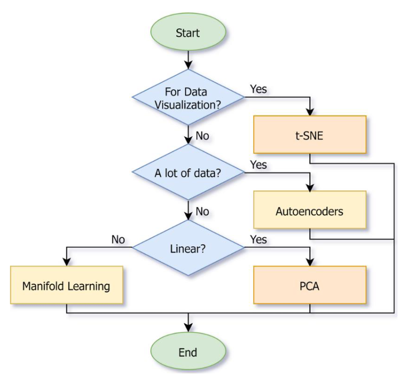
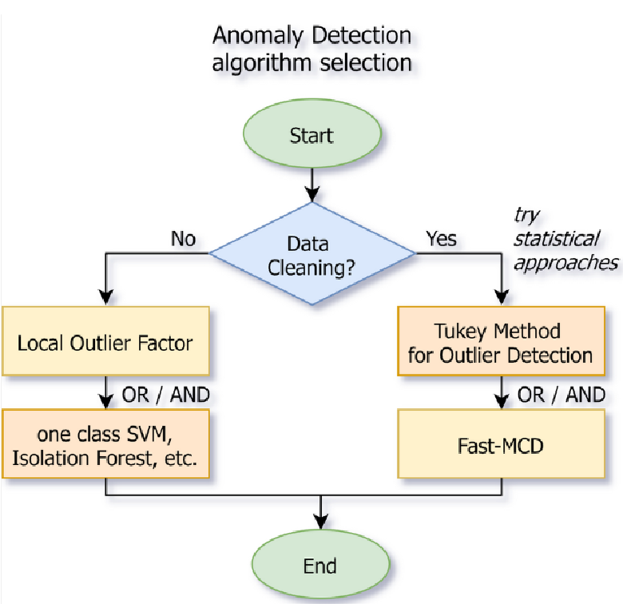

# Aprendizagem Não Supervisionada

## Tarefas

- **Redução da Dimensionalidade**: deve reduzir o número de atributos de *input* num *dataset*;
- **Deteção de Anomalias**: deve detetar instâncias diferentes da norma;
- ****Clustering***: deve agrupar instâncias semelhantes em *clusters*.

## Medidas de Distância

### Medidas de Semelhança

- Distância Euclidiana ou de Manhattan para atributos contínuos;
- Coeficiente de Jacqard para atributos discretos ou binários;
- etc...

## Algoritmos

- **Redução de Dimensionalidade**:
  - *Principal Component Analysis* (PCA);
  - *Manifold Learning* - LLE, *Isomap*, t-SNE;
  - *Autoencoders*, etc...
- **Deteção de Anomalias**:
  - *Isolation Forest*;
  - *Local Outlier Factor*;
  - *Minimum Covariance Determinant*;
  - Outros algoritmos desenhados, inicialmente, para a redução da dimensionalidade ou aprendizagem supervisionada.
- ***Clustering***:
  - *K-Means*;
  - *Hierarchical Clustering* e *Spectral Clustering*;
  - DBSCAN e OPTICS;
  - *Affinity Propagation*;
  - *Mean Shift* e BIRCH;
  - *Gaussian Mixture Models*.

## Redução da Dimensionalidade

- Aplicações destes algoritmos:
  - **Visualização de Dados e Análise de Dados**: reduz o número de atributos de *input* para 2 ou 3 de forma a usar as técnicas de visualização de dados para obter informação sobre os dados;
  - **Ferramenta Preparatória para Algoritmos de *Machine Learning***: mais atributos de *input*, por vezes, tornam a tarefa de previsão do modelo mais difíceis. Visto que muitos algoritmos não funcionam bem com dados dispersos ou de elevadas dimensões, a aplicação deste algoritmo pode aumentar a qualidade dos modelos.
- Os métodos são, geralmente, divididos em:
  - *Feature Selection*: encontra um subconjunto dos atributos de *input*;
  - *Feature Projection* (ou *Feature Extraction*): encontra a projeção ótima dos dados originais em algum espaço de poucas dimensões.
  
### PCA

Utiliza a projeção dos dados originais em componentes principais. Os componentes principais são vetores ortogonais que descrevem o máximo de variação residual.

Devem-se seguir os seguintes passos:

1. *Standardizar* os dados;
2. Construir uma matriz de correlação;
3. Calcular os *eigenvectors*/*unit vectors* e *eigenvalues*. Os *eigenvalues* são escalares que podemos multiplicar com o *eigenvector* da matriz de correlação.
4. Ordenar os *eigenvectors* do de maior ordem para o mais pequeno e calcular a percentagem da variação que cada PC tem;
5. Selecionar o número de componentes. Desenhar um gráfico das somas acumuladas da variância e, em seguida, selecionar o número de componentes que explica a taxa de informação pretendida (geralmente, entre 80\% ou 95\%).

Versões do PCA:

- ***Incremental PCA***: para aprendizagem *online*, quando os dados não cabem em memória;
- ***Randomized PCA***: algoritmo estocático que permite uma estimativa rápida dos primeiros $N$ componentes;
- ***Kernel PCA***: truques de *kernel* permitem que sejam efetuadas projeções não lineares complexas.

### *Mainfold Learning*

Baseados na conservação da distância medida.

- **LLE (*Locally Linear Embedding*)** estuda as conexões lineares entre pontos de dados no espaço original e, em seguida, tenta movê-los para um espaço dimensional mais pequeno, enquanto que preserva os seus vizinhos. Existem muitas modificações a este algoritmo, como o MLLE e o HLLE, etc...
- ***Isomap (Isometric Mapping)*** cria um gráfico conectando cada instância aos seus vizinhos mais próximos e, em seguida, reduz a dimensionalidade enquanto tenta manter a distância *geodesic* (distância entre dois vértices num gráfico) entre instâncias;
- ***t-SNE (t-distributed Stochastic Neighbor Embedding)*** reduz a dimensionalidade mantendo a distância relativa entre pontos no espaço, assim mantém instâncias semelhantes perto umas das outras e as instâncias diferentes distantes. Maioritariamente, utiliza-se para a visualização de dados.

### *Autoencoders*

Rede neuronal artificial que tenta manter os valores de *output* o mais semelhantes possível dos valores de *input* quando a estrutura de rede implica um gargalo (camada onde o número de neurónios é muito menor que na camada de *input*).

Variações:

- *Denoising Autoencoders* que podem ajudar a limpar imagens ou sons;
- *Variational Autoencoders* que podem lidar com distribuições, ao invés de valores específicos;
- *Convolutional Autoencoders* para imagens;
- *Recurrent Autoencoders* para séries de tempo ou texto.

### Seleção do Algoritmo

## Deteção de Anomalias

Tarefa de detetar instâncias anormais (*outliers*) para:

- **Limpeza de Dados**: remover *outliers* do *dataset* antes de treinar outro modelo;
- **Tarefas de Deteção de Anomalias**: deteção de fraudes, deteção de produtos com defeito, etc...

### Abordagens

#### Estatísticas

- Distâncias Interquartis;
- *Turkey Method* para a deteção de *outliers*.

#### Algoritmos de *Clustering* ou de Redução de Dimensão

- *Isolation Forest* e SVM (SVM de uma classe);
- *Local Outlier Factor* (LOF) - baseado na assunção que as anormalidades estão localizadas em regiões de pouca densidade;
- *Minimum Covariance Determinant* (MCD) - útil para a limpeza de dados. Assume que os *inliers* são gerados por uma distribuição Gaussiana singular e que os *outliers* não foram gerados por esta distribuição.

### Seleção do Algoritmo

## *Clustering*

Tarefa de agrupar uma população de pontos de dados não etiquetados em *clusters* de forma a que os pontos de dados num *cluster* sejam mais semelhantes entre si do que com pontos de outros *clusters*.

Aplicações:

- *Engines* de recomendações;
- *Clustering* de artigos semelhantes;
- Imagem médica;
- Segmentação de imagens;
- Deteção de anomalias;
- Reconhecimento de padrões.

Todos os algoritmos de *clustering* requerem o pré-processamento de dados (p.e. redução da dimensionalidade) e a sua *standardização*.

### Algoritmos

#### *K-Means*

Baseado no conceito de centróide, sendo este o centro geométrico de um *cluster* (média das coordenadas de todos os pontos do *cluster*).

Etapas:

1. Centróides são inicializados de forma aleatória (existem outras técnicas de inicialização);
2. Iterativamente, faz os seguintes passos, enquanto os centróides se vão movendo:
  1. Atualiza os *clusters* - fornece o *cluster* com o centróide mais próximo a cada ponto de dados;
  2. Atualiza os centróides dos *clusters* . calcula o novo valor da média dos elementos de cada *cluster* de forma a mover os centróides.
3. Calcula a variação total.

**Pontos Fortes**:

- Simples e intuitivo;
- Escalável para grandes *datasets*;
- Como resultado, também teremos os centróides que podem ser utilizados como representantes dos *clusters standard*.

**Pontos Fracos**:

- Conhecimento acerca do número de *clusters* é necessário e deve ser especificado como parâmetro;
- Não lida bem com grandes números de atributos;
- Apenas separa bem os *clusters* de forma convexa e homogénea;
- Poderá fornecer más soluções locais, pelo que deve ser corrido múltiplas vezes.

#### *Elbow Method*

Heurística utiliza para determinar o número de *clusters* num *dataset*. O método consiste em dar *plot* da variação em função do número de *clusters* e escolher o "*elbow*" da curva como o número de *clusters* a utilizar. 

Pode utilizar-se o mesmo método para escolher o número de parâmetros em outros modelos orientados aos dados, tais como o número de componentes principais que descrevem um *dataset*.

#### *Hierarchical Clustering*

Família de algoritmos de *clustering* que controem uma hierarquia de *clusters* durante a análise:

- Inicia como tendo pontos como *clusters* individuais;
- A cada passo, ginta os pares de *clusters* mais próximos até restar apenas um ou $K$ *clusters*.

**Pontos Fortes**:

- Simples e intuitivo;
- Funciona bem quando os dados têm uma estrutura hierárquica;
- Conhecimento acerca do número de *clusters* não é necessário.

**Pontos Fracos**:

- Precisa de análise adicional para escolher o número de *clusters* de resultado pretendidos;
- Apenas separa bem os *clusters* de forma convexa e homogénea;
- Algoritmo *greedy* que pode resultar em soluções locais fracas.

#### Distância

- Métodos para medir a distância entre dois *clusters*:
  - ***Simple Linkage***: distância mínimo entre elementos de cada *cluster*;
  - ***Complete Linkage***: distância máxima entre elementos de cada *cluster*;
  - ***Average Linkage***: distância média entre todos os pares de pontos;
  - ***Centroid Linkage***: distância entre os centróides dos *clusters*;
  - ***Ward's Linkage***: o aumento dentro da variância do *cluster* é o de menor grau (semelhança entre *clusters*).
  
#### *Spectral Clustering*

Abordagem baseada na teoria de grafos e em álgebra linear. Utiliza o *spectrum* (conjunto de *eigenvalues*) da matriz de semelhança (contém a semalhança de cada par de pontos de dados) de forma a efetuar a redução da dimensionalidade. Em seguida, usa alguns algoritmos de *clustering* neste espaço de pouca dimensão.

**Pontos Fortes**:

- Pode detetar estruturas e formas de *clusters* complexas;
- Pode ser utilizado para procurar *clustes* em gráficos.

**Pontos Fracos**:

- Conhecimento acerca do número de *clusters* é necessário e deve ser especificado como parâmetro;
- Não lida bem com um grande número de instâncias;
- Não lida bem quando os *clusters* têm tamanhos muito diferentes.

#### DBSCAN

Neste algoritmo, os *clustes* são regiões de grande densidade (em que os pontos de dados estão localizados próximos uns dos outros) separados por regiões de baixa densidade (onde os pontos estão localizados longe uns dos outros).

O conceito central deste algoritmo é a ideia de um *core sample*, ou seja uma amostra numa área de grande densidade. O ponto A é considerado o *core sample* se, pelo menos `min_samples` de outras instâncias (geralmente, incluindo A) estão localizadas no máximo a `eps` de distância de A.

**Pontos Fortes**:

- Conhecimento acerca do número de *clusters* não é necessário;
- Resolve a tarefa de deteção de anomalias.

**Pontos Fracos**:

- Precisa de selecionar e dar *tune* ao parâmetro de densidade (`eps`);
- Não lida bem com dados dispersos.

#### *Affinity Propagation*

Baseado na ideia de passar mensagens entre os pontos de dados. Calcula a semelhança entre pares baseada em alguma função de distância e, em seguida, converge para o número de representativos *standard*, Um *dataset* é descrito utilizando um pequeno número de representativos *standard*, que sã́o identificados como as instâncias mais representativas de um dado *cluster*.

**Pontos Fortes**:

- Conhecimento acerca do número de *clusters* não é necessário;
- Como resultado, também se terá os representativos de um *cluster*. Ao contrário do *k-means*, estas instâncias não são apenas valores médios, mas sim objetos reais do *dataset*.

**Pontos Fracos**:

- Algoritmo lento devido à sua complexidade;
- Não lida bem com um grande número de instâncias;
- Apenas separa bem os *clusters* de forma convexa e homogénea.

#### *Mean Shift*

Inicialmente, coloca um círculo de um dado tamanho (o raio do círculo é um paràmetro e é denominado *bandwidth*) no centro de cada ponto de dados. Após isso, iterativamente calcula a média para cada círculo (a média das coordenadas dentro do ponto) e dá *shift* disso. Estes passos, denominados *mean-shift* são efetuados até o algoritmo convergir e os círculos pararem de se mover.

**Pontos Fortes**:

- Conhecimento acerca do número de *clusters* não é necessário;
- Só tem um híper-parâmetro; o raio dos círculos;
- Resolve a tarefa da estimativa da densidade e calcula os centróides dos *clusters*;
- Não encontra nenhum cluster que de facto não exista.

**Pontos Fracos**:

- Não lida bem com dados dispersos e com um grande número de atributos;
- Não lida bem com um grande número de instâncias;
- Não lida bem com *clusters* com formas complexas: tende a parti-los em pedaços mais pequenos.

#### BIRCH

*Balanced Iterative Reducing and Clustering using Hierarchies*. Algoritmo de hierarquia de *clusters* desenhado especialmente para grandes *datasets*. Durante o treino, cria um *dendrogram* que contém informação suficiente para, rapidamente, dar *assign* a novas instâncias de dados para um *cluster* sem guardar informação acerca de todas as instâncias em memória,

**Pontos Fortes**:

- Desenhado, especialmente, para *datasets* muito grandes;
- Apresenta a melhor qualidade para um dado conjunto de memória e recursos de tempo;
- Permite a implementação de *online clustering*.

**Pontos Fracos**:

- Não lida bem com um grande número de atributos.

#### Seleção de Algoritmo

Esta tarefa é bastante difícil e tem uma grande variedade de aplicações, então é quase impossível contruir uma regra universal para a seleção do algoritmo de *clustering*, pois todos têm vantagens e desvantagens.

As coisas começam a melhorar quando se fazem assunções acerca dos dados em mão, assim a análise de dados pode ajudar-nos a selecionar o algoritmo mais eficaz.

Se o número de *clusters* for desconhecido, uma boa aproximação inicial é a raíz quadrada do número de objetos. Além disso, também se pode correr um algoritmo que não necessite esta informação e utilizar o seu resultado como ponto de partida para o número de *clusters* necessário.
