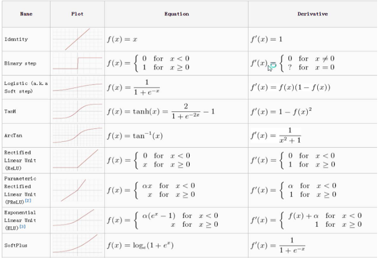
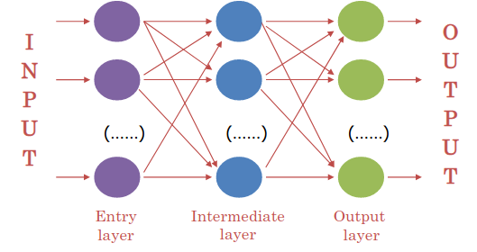
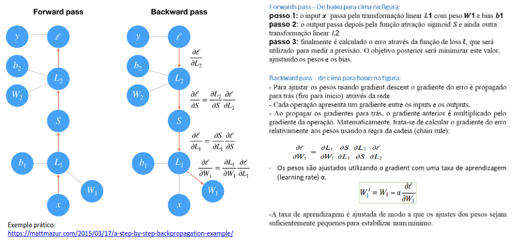

# Redes Neuronais Artificiais

- São modelos de *machine learning* que funcionam de forma análoga ao cérebro humano. É um processador paralelo composto por nodos de processamento singulares (neurónios);
- O conhecimento é guardado em conexões entre os neurónios;
- O conhecimento é obtido de um ambiente (dados), através de um processo de aprendizagem (algoritmo de treino) que ajustam os parâmetros da rede;

## Benefícios/Razões para o Sucesso

- **Aprendizagem/Generalização**: permite a obtenção de novo conhecimento do ambiente;
- **Processamento paralelo massivo**: permite que tarefas complexas sejam efetuadas num curto espaço de tempo;
- **Não linear**: útil para muitos problemas reais;
- **Adaptabilidade**: podem adaptar a sua topologia de acordo com as mudanças no ambiente;
- **Robustez e degradação suave**: disponível para ignorar ruído e atributos irrelevantes, capaz de lidar com informação em falta de forma eficiente;
- **Flexibilidade**: tem um grande domínio de aplicabilidade;
- **Usabilidade**: pode ser utilizada como "*black boxes*", não precisa de conhecimento explícito acerca da função a aprender.

## Tipos Comuns de Aplicação

- Memória Associativa;
- Classificação/Diagnóstico;
- Reconhecimento de padrões;
- Regressão;
- Controlo;
- Otimização;
- Filtragem de dados/compressão;
- etc...

## Neurónios Artificiais

- Recebem um conjunto de *inputs*, dados ou conexões ($x_i$);
- Têm um peso (valor numérico) associado a cada conexão ($w_i$);
- Cada neurónio calcula a sua ativação baseado nos valores de *input* e dos pesos das conexões;
- O sinal calculado é passado para o *output* após ser filtrada pela função de ativação ($f()$).

## Funções de Ativação

- *Sigmoid*/Logística;
- Linear;
- Tangente hiperbólica (*Tanh*);
- Gaussiana;
- ReIU (*linear rectified*). 

## Arquiteturas de Redes (topologias)

- Forma como os nodos se encontram interconectados numa rede estruturada;
- Existem múltiplos tipos de arquiteturas, cada uma com o seu próprio potencial, tendo duas categorias: **supervisionadas** e **não supervisionadas**.

## Topologia *Feedforward*

- ***Multilayer Perceptron (MLP)*** - *Feedforward* totalmente conectado numa rede neuronal com múltiplas camadas intermédias.

## Problemas de Classificação

Se usarmos modelos funcionais para para problemas de classificação, então teremos de converter os *outputs* do modelo (valores numéricos) nos valores desejados pelo atributo de *output* (nominais), isto é, em classes expectáveis.

Podemos escolher entre duas hipóteses: um neurónio a dividir o domínio ou *1-of-C*/*one-hot encoding*.

No último aso, teremos $M$ *outputs* numéricos (1 por classe) e a classe correspondente ao maior valor é, geralmente, escolhida.

Neste caso, facilmente calculamos as probabilidades para cada classe (função *softmax*).

## Treino

**Dados**: exemplos de treino que consistem em *inputs* e nos seus *outputs* desejáveis;

**Objetivo**: arranjar os pesos das conexões de forma a minimizar a perda de cada função: no caso dos ANNs é a generalização do custo da função de regressão logística.

Existem múltiplos algoritmos de treino baseados no *descending gradient*:

- O mais usado é a *backpropagation*;
- Outros: *Marquardt-Levenberg*, *Rprop*, *Quickprop*, etc...

## Algoritmo de *Backpropagation*

- Baseado no vetor gradiente da superfície de erro que define a direção do *maximum descent* - método semelhante ao descendente do gradiente;
- Parâmetro importante: taxa de aprendizagem que define a distância qe um algoritmo anda;
- A sequência destes movimentos lidam a um mínimo (no melhor caso, global);
- Execuções do treino para um dado número de *epochs*: define o número de vezes que cada caso é treinado pela rede, sendo que os exemplos tipicamente são divididos em *batches* (subconjuntos de exemplos);
- Configuração inicial da rede é, geralmente, gerada de forma aleatória;
- **Critério de Paragem**: número fixo de *epochs*, tempo e critério de convergência baseado num subconjunto de exemplos de validação.

### Fases

- ***Forward Propagation***: calcula o valor de *output* para o vetor de *input* e o erro cometido;
- ***Backpropagation***: dado o erro cometido, este é propagado para trás, ajustando os pesos das conexões da direção do seu decréscimo. É baseado no cálculo do gradiente utilizando a regra em cadeia para funções compostas.

## Suma

- Embora existam muitas variantes de redes neuronais, cada uma pode ser definida em termos de:
  - **Função de ativação**: transforma o *input* da rede de um nodo num único sinal de *output* que será propagado para a frente na rede;
  - **Arquitetura de Rede** ou topologia: descreve o número de nodos do modelo e o número de camada e a forma como elas estão conectadas;
  - **Algoritmo de Treino**: especifica como é que os pesos das conexões são definidos de forma a inibir ou excitar neurónios em proporção com o sinal de *input*.

## Escolha da topologia para *feedforward* ANN/hiperparâmetros

- Quando nodos de *input* e *output*?
- Quantas camadas e nodos intermédios?
- Como conectar os neurónios?
- Conexões mais curtas?
- **Modelo mais simples**: *Feedforward Networks with fully interconnected layers* (MLP).

### Arquitetura da Rede (Topologia)

- A capacidade da rede neuronal aprender é baseada na sua arquitetura ou em padrões e estruturas de neurónios interconectados;
- Determina a complexidade das tarefas que podem ser aprendidas pela rede;
  - Geralmente, redes mais largas e complexas são capazes de identificar padrões mais súbtis e limites de decisões complexas;
  - No entanto, o poder da rede não é apenas em função do seu tamanho, mas sim da maneira que as suas unidades estão colocadas.
    - Número de camadas;
    - Direção do *flow* de informação;
    - Número de nodos em cada camada da rede.
- O número de camadas escondidas, tipicamente:
  - 1 camada tem capacidade para aproximar qualquer área de decisão linear (semiplano);
  - 2 camadas aproximam qualquer área de decisão contínua (regiões convexas);
  - 3 camadas aproximam qualquer área de decisão (regiões arbitrárias).

### Número de Nodos em cada Camada

- O número de nodos de *input* é pré-determinado pelo número de atributos dos dados de *input*;
- O número de nodos de *output* é pré-determinado pelo número de resultados que devem ser modelados ou pelo número de classes no resultado;
- O número de nodos escondidos é deixado a escolher ao utilizador antes de treinar o modelo, não havendo qualquer regra fiável para definir o número de neurónios na camada escondida:
  - Um grande número de neurónios terá tendência a deixar os resultados muito semelhantes aos dados de treino, correndo o risco de *overfitting*, ou seja, pode generalizar mal para dados desconhecidos;
  - Redes neuronais grandes também podem ser computacionalmente caras e lentas para treinar;
  - Um número pequeno de neurónios pode não ser suficiente para modelar a área de decisão pretendida;
  - Devem ser testados os valores de neurónios entre metade e o dobro dos neurónios presentes na camada de *input*;
  - Devemos utilizar o modelo que tenha menos nodos e resulte num desempenho adequado num *dataset* de validação.

### Generalização/*Overfitting*

- *Overtraining* uma ANN pode prevenir a generalização por *overfitting*. A ANN memorizará os casos de treino e não as regras de generalização, o treino pode ser parado mais cedo;
- A regularização pode ser usada de forma semelhante à regressão logística/linear;
- A probabilidade de *overfitting* aumenta se:
  - Tivermos poucos casos de treino (qualidade das amostras);
  - Tivermos demasiadas conexões (complexidade da rede).

## *Training Process "A Better Model"*

### *Underfitting*

Este modelo falha na complexidade necessária para capturar corretamente a complexidade inerente ao problema que se pretende resolver. Podemos reconhecer esta situação quando o erro é demasiado grande, tanto nos casos de treino e nos casos de (validação) teste.

### *Overfitting*

Este modelo utiliza demasiados parâmetros e foi treinado em demasia.

Especificamente, aprendeu a identificar qualquer caso no conjunto de treino, tornando-se tão específica que não é capaz de generalizar para imagens semelhantes. Podemos reconhecer esta situação quando o erro nos casos de treino é muito menor que os casos de teste.

Medidas para reduzir o *overfitting*:

- Adicionar mais casos ao conjunto de treinos;
- Utilizar arquiteturas que demonstraram generalizar bem;
- Reduzir a complexidade da arquitetura de rede;
- Usar *data augmentation*;
- Adicionar normalização (*Batch Normalization Layer*);
- Adicionar *dropout* (*Dropout Layer*).

## *Training Process "Learning Curves"*

1. Um modelo que esteja em *underfit* que não tenha capacidade suficiente pode ser demonstrado como uma linha reta ou valores de ruída de uma perda relativamente grande, indicando que o modelo não foi capaz de aprender o *dataset*.
   1. **Adicionar mais observações**: podemos não ter dados suficientes para os padrões existentes terem sinais fortes;
   2. **Adicionar mais atributos**: ocasionalmente, este modelo está em *underfit*, porque os atributos são insuficientes;
   3. **Reduzir a regularização do modelo**: se tivermos parâmetros de regularização explícitos, devemos remover ou reduzir esses parâmetros;
   4. **Aumento da capacidade do modelo**: a capacidade do modelo pode não ser suficientemente grande para capturar ou aprender sinais existentes.
2. Um modelo que esteja em *underfit* que precisa de mais treino pode ser demonstrado como um perda de treino que vai diminuindo até ao fim do gráfico. Isto indica que o modelo é capaz de aprender mais e melhores e o processo de treino foi parado prematuramente.
   1. **Aumentar o número de *epochs***: até a curva de validação para de melhorar. É uma boa altura para aumentar muito o número de *epochs* e adicionar uma paragem *early* de forma a identificar quantos *epochs* são requeridos;
   2. Se estiver a demorar demasiado tempo para chegar ao mínimo para a curva de validação, devemos **aumentar a taxa de aprendizagem** para aumentar a travessia e adicionar um *callback* para ajustar, de forma automática, a taxa de aprendizagem.
3. Um exemplo de um modelo em *overfit* pode ser demonstrado por um ponto de inflexão na *validation loss* que pode ser o ponto no qual se pode parar a experiência, visto ter demonstrado as dinâmicas do *overfitting*.
   1. Regulariza o quão rápido um modelo aprende ao reduzir a sua taxa de aprendizagem. Adiciona um *callback* para, de forma automática, reduzir a taxa de aprendizagem como a *validation loss plateaus*;
   2. Regulariza a capacidade do modelo de reduzir o número e/ou o tamanho das camadas escondidas;
   3. Regulariza os pesos de forma a controlar a complexidade da rede;
   4. Regulariza os padrões de ocorrência adicionar um *dropout* de forma a minimizar a chance de encontrar padrões que encaixem e gerem ruído nos dados.
4. Um *dataset* de treino pode ser muito pequeno relativamente ao seu *dataset* de validação, esta situação pode ser identificada através de uma curva de aprendizagem para perda de treino que demonstra uma melhoria e uma semelhança com a curva de aprendizagem para *validation loss* que apresenta melhora, mas uma grande *gap* mantém-se entre as curvas.
   1. **Adicionar mais observações**: podemos não ter dados suficientes para capturar padrões presentes tanto nos dados de treino, como de validação;
   2. Devemos garantir que estamos a selecionar opções de *sampling* de forma aleatória para utilizarmos nos conjuntos de treino e de validação. Se os dados estiverem ordenados por algum atributo então os dados a validar podem ter atributos não representados nos dados de treino;
   3. Fazer *cross-validation* de forma a fazer com que todos os dados tenham a oportunidade de ser representados tanto nos conjuntos de treino e de validação.
5. Um *dataset* de validação que possa ser demasiado pequeno relativamente aos dados de treino pode ser demonstrado por uma curva de aprendizagem para *training loss* que aparenta ser um bom *fit* e uma curva de aprendizagem para *validation loss* que mostra movimentos de ruído à volta da *training loss*.
   1. Adicionar mais observações ao *dataset* de validação;
   2. Se estivermos num número limitado de observações, devemos fazer *cross-validation* de forma a que todos os dados tenham oportunidade de serem representados nos conjuntos de treino e de validação.
6. Um conjunto de validação que seja mais fácil de prever que o conjunto de dados de treino pode ser identificado pela *validation loss* que é menor que a *training loss*.
   1. Verificar que não se tem observações duplicadas entre os *datasets* de treino e de validação;
   2. Verificar que não existe fuga de informação entre os *datasets* de treino e de validação;
   3. Verificar que se estão a escolher amostras aleatórios, para que a variância dos atributos seja consistente em ambos os conjuntos;
   4. Fazer *cross-validation* de forma a fazer com que todos os dados tenham a oportunidade de ser representados tanto nos conjuntos de treino e de validação.

## Redes Neuronais Artificiais

- **Pontos Fortes**:
  - A *accuracy* de problemas de classificação é geralmente elevada para problemas complexos;
  - Processamento distribuído, o conhecimento é distribuído pelos pesos das conexões;
  - Robusto a lidar com exemplos, mesmo que estes contenham erros;
  - Lida bem com atributos redundantes, desde que o peso associado a eles seja pequeno;
  - Resultados podem ser discretos, valores reais ou um vetor de valores (discretos ou reais).
- **Pontos Fracos**:
  - Dificuldade em determinar a topologia de rede ótima para um problema;
  - Dificuldade para usar, pois tem muitos parâmetros para definir;
  - Precisa de pré-processamento específico de dados;
  - Precisa de muito tempo para treino;
  - Dificuldade a aprender a função de aprendizagem (pesos);
  - Conhecimento descoberto não pode ser lido;
  - Não providencia explicações para os resultados;
  - A incorporação do domínio de conhecimento não é fácil.

## *Frameworks*

- Componentes fundamentais em qualquer *framework* DL:
  - *The Tensor Object*;
  - Operações no *Tensor Object*;
  - Computação e otimização de grafos;
  - Ferramentas de diferenciação automática;
  - Extensões BLAS/cuBLAS e cuDNN.