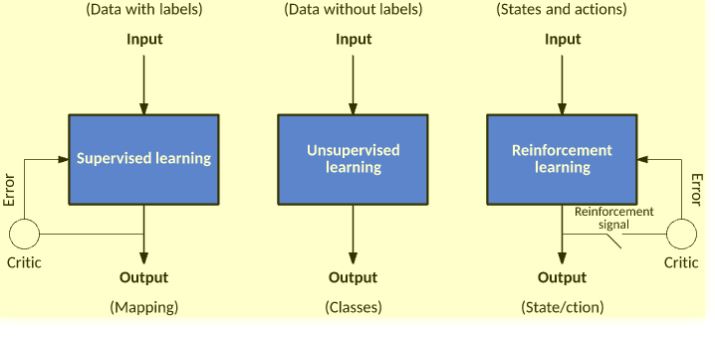

# Aprendizagem por Reforço

- A aprendizagem por reforço é um método de aprendizagem sobre o que fazer de forma a maximizar um valor numérico de prémio;
  - Não é dito ao aprendiz que ações deve efetuar;
  - Deve descobrir quais as ações que garantem o melhor retorno, tentando abordá-las.
- Características essenciais:
  - *Tryal-and-error*;
  - *Delayed reward*.
- Características complementares:
  - Tempo;
  - Existe um aprendiz, mas não um professor.
- Não é definido pela caracterização de métodos de aprendizagem (não programamos algoritmos para aprender);
- É definido pela caracterização do problema de aprendizagem (programamos as características do problema que pretendemos aprender);
- Não toma decisões com base em experiências passadas (ao contrátrio das CBR ou ANN);
- Olha para o estado atual e decide o que fazer, prevendo o futuro expectável.

## Aplicações

- Robótica para automação da indústria;
- Planeamento de estratégia de negócio;
- *Machine Learning* e processamento de dados;
- Ajuda na criação de sistemas de treino que providenciam instruções personalizadas e materiais de acordo com os requisitos dos estudantes;
- Controlo aéreo e controlo de movimentos de *robots*;
- Carros autónomos.

**Quando não usar?**

- Quando temos dados suficientes para resolver o problemas com um método de aprendizagem supervisionada;
  - Aprendizagem por reforço é **computacionalmente pesada** e **consome muitp tempo**, especialmente, quando o espaço de ação é grande.

## Termos

- **Agente** ($A$): Entidade assumida que toma ações num ambiente de forma a ganhar algum prémio;
- **Ambiente** ($e$): Cenário que um agente tem de enfrentar;
- **Prémio** ($R$): Retorno imediata dado a um agente quando toma uma ação específica ou executa uma tarefa;
- **Estado** ($S$): Refere-se à situação atual retornada pelo ambiente;
- **Política** ($\pi$): Estratégia a ser aplicada pelo agente de forma a decidir a próxima ação baseada no estado atual;
- **Valor** ($V$): Retorno esperado a longo-prazo tendo um desconto quando comparado ao prémio a curto-prazo;
- **Função Valor**: Especifica o valor de um estado que é o valor total do prémio. Pode ajudar o agente acerca do caminho que este deve tomar;
- **Modelo do Ambiente**: Imita o comportamento do ambiente. Ajuda a fazer inferências e a determinar como o ambiente se irá comportar;
- **Métodos baseados em modelos**: Método para resolver problemas de aprendizagem por reforço que utilizam *model-based methods*;
- *Q value* ou *action value* ($Q$): Muito semelhante ao valor. A única diferença entre os dois é que tem um parâmetro adicionar, a ação atual.

## Procedimento

- Agente toma ações no ambiente;
- Ambiente dá-lhe um prémio/*penalty*;
- Agente calcula a conveniência da ação;
- Agente toma uma nova ação no novo ambiente.

Assim:

- O ciclo de vida produz uma sequência de estados, $S_i$, ações $A_i$ e prémios imediatos, $R_i$;
- Cada vez que um agente toma uma ação no ambiente, é-lhe fornecido um prémio ou uma *penalty* demonstrando o quão desejada era a sua ação;
- A função do agente é aprender a política de controlo, $\pi: S \rightarrow A$, que maximiza a soma (expectável) de prémios, sendo que os prémios futuros serão descontados de forma exponencial em relação ao seu *delay*: $\sum_{i = 0}^b \gamma^i R_i$

## *Trade-off Exploitation/Exploration* 

- ***Exploration***: é acerca de encontrar mais informações acerca do ambiente, ou seja, explorar muitos estados e ações no ambiente;
- ***Exploitation***: é acerca de dar *exploit* acerca de informação conhecida para maximizar o prémio.

Se selecionarmos uma ação *greedy*, estaremos a dar *exploit* do conhecimento atual acerca do valor das ações. 

Se selecionarmos uma ação não-*greedy*, entaõ estaremos a explorar, visto que isto providencia que melhoremos a nossa estimativa dos valores da ação não-*greedy*.

## Cálculo do *Q-Value*

- *Temporal Difference Learning*:
  - O agente começa por assumir que todos os estados e todas as ações têm um valor inicial de 0;
  - O agente atualiza os valores calculando a diferença entre o valor esperado e o valor encontrado.
- *Q-Learning*:
  - $Q(s_t, a_t)$: valor de tomar uma ação $a_t$ num estado $s_t$;
  - $r_{t+1}$: recompoensa imediata;
  - $\alpha$: taxa de aprendizagem, $0 \lt \alpha \lt \lt 1$;
    - Proporção usada para atualizar o valor de utilidade após cada ação.
  - $\gamma$: fato de desconto, $0 \lt \lt \gamma \lt 1$;
    - Encoraja o agente a preferir recompensas imediatas a tardias.
  - $Q(s_t, a_t) = Q(s_t, a_t) + \alpha[r_{t+1} + \gamma \times Q(s_{t + 1}, a_{t + 1}) - Q(s_t, a_t)]$.

## *Q-Learning vs SARSA*

- SARSA:
  - $Q(s_t, a_t) = Q(s_t, a_t) + \alpha[r_{t + 1} + \gamma \times Q(s_{t + 1}, a_{t + 1}) - Q(s_t, a_t)].
    - O agente está no estado 1, realiza a ação 1 e obtém a recompensa 1;
    - No estado 2, realiza a ação 2 e obtém a recompensa 2 e ,então, atualiza o valor da ação 1 no estado 1.
- *Q-Learning*:
  - $Q(s_t, a_t) = Q(s_t, a_t) + \alpha[r_{t + 1} + \gamma \times MAX_a\ Q(s_{t + 1}, a_{t + 1}) - Q(s_t, a_t)];
    - O agente está no estado 1, realiza a ação 1 e obtém a recompensa 1;
    - Vê a recompensa máxima no estado 2 e atualiza o valor da ação 1 realizado no estado 1.
- O SARSA considera a política de controlo que está a ser seguida e atualiza o valor das ações;
- O *Q-Learning* assume que está sempre a seguir uma política ótima e utiliza-a para atualização.

